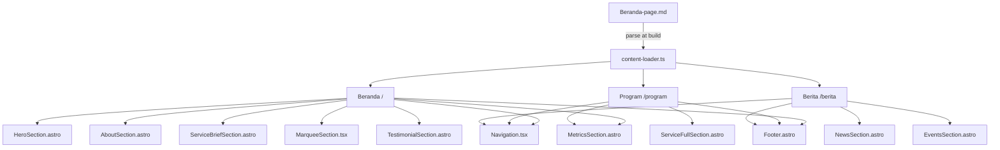

# Design Document — Exalter Students Landing Page

## Overview

Exalter Students Landing Page adalah situs web statis tiga halaman yang dibangun dengan Astro 6, React 19, Tailwind CSS v4, dan shadcn/ui. Situs ini berfungsi sebagai wajah publik platform inovasi dan pendidikan pemuda Indonesia, menampilkan program, pencapaian, berita, dan acara kepada calon peserta.

Seluruh konten bersumber dari satu file markdown (`client/public/contents/Beranda-page.md`) yang di-parse saat build time oleh Astro. Pendekatan ini memisahkan konten dari kode komponen sehingga pembaruan konten tidak memerlukan perubahan kode.

**Stack:**
- Astro 6 (static site generation, routing berbasis file)
- React 19 (komponen interaktif: navigasi mobile, marquee)
- Tailwind CSS v4 (utility-first styling)
- shadcn/ui (komponen UI dasar)
- Inter Variable Font (tipografi utama)
- Lucide React (ikon)

**Palet Warna:**
- Primer: `#1E3A8A` (biru tua)
- Aksen biru: `#3B82F6`
- Teks utama: `#0F172A` (navy gelap)
- Latar belakang: putih / off-white `#F8FAFC`
- Aksen CTA: `#F59E0B` (amber)

---

## Architecture

Arsitektur mengikuti pola Astro Islands: halaman adalah file `.astro` yang menghasilkan HTML statis, dengan "pulau" React hanya untuk komponen yang membutuhkan interaktivitas (navigasi mobile, marquee animasi).



### Keputusan Arsitektur

1. **Astro `.astro` untuk section statis** — Semua section yang tidak memerlukan interaktivitas (Hero, About, Service, Metrics, Testimonial, News, Events, Footer) diimplementasikan sebagai komponen `.astro` untuk zero JavaScript overhead.

2. **React `.tsx` untuk komponen interaktif** — Navigation (hamburger menu mobile) dan MarqueeSection (animasi CSS + pause-on-hover) menggunakan React dengan `client:load` directive.

3. **Content loader terpusat** — Satu modul TypeScript (`src/lib/content-loader.ts`) bertanggung jawab mem-parse `Beranda-page.md` dan mengekspor typed data objects. Semua halaman mengimpor dari modul ini.

4. **CSS-only marquee animation** — Animasi marquee diimplementasikan dengan CSS `@keyframes` dan `animation-play-state: paused` on hover, tanpa library tambahan.

---

## Components and Interfaces

### Struktur File

```
client/src/
├── lib/
│   ├── utils.ts                    # (existing)
│   └── content-loader.ts           # parse Beranda-page.md → typed data
├── components/
│   ├── ui/
│   │   └── button.tsx              # (existing shadcn)
│   ├── Navigation.tsx              # React: logo + nav links + hamburger
│   ├── Footer.astro                # kontak, sosmed, copyright
│   ├── HeroSection.astro           # judul, subjudul, CTA
│   ├── AboutSection.astro          # nilai-nilai + ringkasan
│   ├── ServiceBriefSection.astro   # 3 kartu layanan singkat
│   ├── ServiceFullSection.astro    # 6 kartu layanan lengkap
│   ├── MetricsSection.astro        # metrik + kartu berita pencapaian
│   ├── MarqueeSection.tsx          # React: animasi logo mitra + testimonial
│   ├── TestimonialSection.astro    # 3 kartu ulasan
│   ├── NewsSection.astro           # 5 kartu berita
│   └── EventsSection.astro        # 12 daftar acara
└── pages/
    ├── index.astro                 # Beranda (/)
    ├── program.astro               # Program/Layanan (/program)
    └── berita.astro                # Berita & Acara (/berita)
```

### Interface Komponen Utama

```typescript
// src/lib/content-loader.ts — tipe data yang diekspor

interface HeroContent {
  title: string;
  subtitle: string;
}

interface ValueCard {
  name: string;        // "Innovation" | "Collaboration" | "Acceleration"
  description: string;
}

interface AboutContent {
  title: string;
  subtitle: string;
  valueCards: ValueCard[];
  summaryTitle: string;
  summaryDescription: string;
}

interface ServiceCard {
  name: string;
  description: string;
}

interface MetricItem {
  value: string;   // e.g. "15+"
  label: string;   // e.g. "Program inspiratif dan inovatif"
}

interface AchievementCard {
  title: string;
  description: string;
}

interface MetricsContent {
  title: string;
  description: string;
  metrics: MetricItem[];
  achievementCards: AchievementCard[];
}

interface TestimonialCard {
  name: string;
  role: string;
  quote: string;
}

interface NewsCard {
  date: string;
  title: string;
  url: string;
}

interface EventCard {
  name: string;
  date: string;        // ISO-parseable string untuk sorting
  url: string;
}

interface SiteContent {
  hero: HeroContent;
  about: AboutContent;
  serviceBrief: { title: string; cards: ServiceCard[] };
  serviceFull: { title: string; subtitle: string; cards: ServiceCard[] };
  metrics: MetricsContent;
  marquee: { title: string; description: string };
  testimonials: TestimonialCard[];
  news: NewsCard[];
  events: EventCard[];
}
```

### Navigation Component

```typescript
// Navigation.tsx — props interface
interface NavigationProps {
  currentPath: string;  // Astro.url.pathname, digunakan untuk active link
}
```

Navigation merender logo + tiga tautan. Pada mobile (`< 768px`) menampilkan hamburger button yang toggle menu. Active link ditentukan dengan membandingkan `currentPath` dengan href masing-masing tautan.

---

## Data Models

### Parsing Strategy

`content-loader.ts` membaca `Beranda-page.md` menggunakan `fs.readFileSync` (tersedia di Astro build time via Node.js). File di-parse dengan regex/string splitting berdasarkan heading markers (`##`, `###`, `####`).

```mermaid
flowchart LR
    A[Beranda-page.md] -->|readFileSync| B[raw string]
    B -->|splitBySection| C[section map]
    C -->|parseHero| D[HeroContent]
    C -->|parseAbout| E[AboutContent]
    C -->|parseServices| F[ServiceCard[]]
    C -->|parseMetrics| G[MetricsContent]
    C -->|parseTestimonials| H[TestimonialCard[]]
    C -->|parseNews| I[NewsCard[]]
    C -->|parseEvents| J[EventCard[]]
    D & E & F & G & H & I & J --> K[SiteContent]
```

### Event Sorting

Events di-sort secara kronologis terbaru ke terlama. Tanggal dalam format "D Bulan YYYY" (bahasa Indonesia) di-parse ke objek `Date` menggunakan mapping nama bulan Indonesia → angka bulan.

```typescript
const BULAN: Record<string, number> = {
  Januari: 0, Februari: 1, Maret: 2, April: 3,
  Mei: 4, Juni: 5, Juli: 6, Agustus: 7,
  September: 8, Oktober: 9, November: 10, Desember: 11
};
```

### Marquee Implementation

Marquee menggunakan teknik duplikasi DOM: daftar logo dirender dua kali secara berurutan dalam satu container, lalu CSS `@keyframes` menggeser container ke kiri sebesar 50% (lebar satu set logo) secara infinite. Ini menciptakan seamless loop tanpa JavaScript.

```css
@keyframes marquee {
  from { transform: translateX(0); }
  to   { transform: translateX(-50%); }
}
.marquee-track {
  animation: marquee 30s linear infinite;
}
.marquee-track:hover {
  animation-play-state: paused;
}
```

---

## Correctness Properties

*A property is a characteristic or behavior that should hold true across all valid executions of a system — essentially, a formal statement about what the system should do. Properties serve as the bridge between human-readable specifications and machine-verifiable correctness guarantees.*

### Property 1: Active Navigation Link

*For any* halaman yang dirender (Beranda, Program, Berita), tautan navigasi yang sesuai dengan halaman tersebut harus memiliki penanda aktif secara visual (misalnya class CSS aktif), sementara tautan lainnya tidak.

**Validates: Requirements 1.3**

---

### Property 2: Testimonial Card Completeness

*For any* kartu testimonial yang dirender, kartu tersebut harus mengandung nama pengguna, peran/jabatan, dan teks ulasan yang tidak kosong.

**Validates: Requirements 7.2**

---

### Property 3: External Links Open in New Tab

*For any* tautan eksternal pada halaman (tombol "Baca Selengkapnya" pada kartu berita dan tautan acara), elemen anchor tersebut harus memiliki atribut `target="_blank"` dan `rel="noopener noreferrer"`.

**Validates: Requirements 9.3, 9.5**

---

### Property 4: Events Chronological Order

*For any* daftar acara yang dirender, urutan acara harus bersifat kronologis dari terbaru ke terlama berdasarkan tanggal acara.

**Validates: Requirements 9.7**

---

### Property 5: Page Metadata Completeness

*For any* halaman yang dirender, elemen `<html>` harus memiliki atribut `lang="id"` dan elemen `<head>` harus mengandung meta tag `description` yang tidak kosong.

**Validates: Requirements 10.2, 10.3**

---

### Property 6: Image Alt Attributes

*For any* elemen `` yang dirender di seluruh halaman, elemen tersebut harus memiliki atribut `alt` yang tidak kosong.

**Validates: Requirements 10.4**

---

### Property 7: Content Sourced from Markdown

*For any* teks konten utama yang ditampilkan di halaman (judul, subjudul, deskripsi kartu), teks tersebut harus sesuai dengan nilai yang terdapat dalam `Beranda-page.md` setelah proses parsing.

**Validates: Requirements 11.1**

---

## Error Handling

### Parsing Errors

- Jika `Beranda-page.md` tidak ditemukan saat build, `content-loader.ts` melempar error dengan pesan deskriptif yang menghentikan build.
- Jika sebuah section markdown tidak ditemukan, loader mengembalikan nilai default (string kosong atau array kosong) dan mencatat warning ke console, sehingga build tetap berhasil dengan konten parsial.

### Missing Images

- Semua elemen `` harus memiliki atribut `alt` yang bermakna (lihat Property 6).
- Untuk ilustrasi dekoratif yang tidak tersedia, gunakan placeholder SVG inline atau background gradient CSS sebagai fallback.

### External Links

- Semua tautan eksternal (berita, acara) menggunakan `target="_blank" rel="noopener noreferrer"` untuk keamanan dan UX.
- Jika URL tidak valid dalam data markdown, tautan tetap dirender namun tidak ada validasi URL saat build (ini adalah konten statis).

### Responsive Breakpoints

- Komponen menggunakan Tailwind breakpoints: `sm` (640px), `md` (768px), `lg` (1024px), `xl` (1280px).
- Navigation hamburger menu ditampilkan pada `< md` (< 768px).

---

## Testing Strategy

### Pendekatan Dual Testing

Strategi pengujian menggunakan dua lapisan yang saling melengkapi:

1. **Unit tests** — Memverifikasi contoh spesifik, edge case, dan kondisi error
2. **Property-based tests** — Memverifikasi properti universal yang berlaku untuk semua input

### Library

- **Unit & Property tests**: [Vitest](https://vitest.dev/) sebagai test runner
- **Property-based testing**: [fast-check](https://fast-check.io/) untuk generasi input acak
- **Component rendering**: [@testing-library/react](https://testing-library.com/docs/react-testing-library/intro/) untuk komponen React
- Minimum **100 iterasi** per property test (fast-check default: 100)

### Unit Tests (Contoh Spesifik)

Fokus pada verifikasi konten dan struktur yang konkret:

- **Route availability**: Verifikasi bahwa tiga halaman (`/`, `/program`, `/berita`) menghasilkan HTML yang valid saat build
- **Navigation rendering**: Render `Navigation` dan verifikasi logo + tiga tautan hadir
- **Footer rendering**: Render `Footer` dan verifikasi kontak, sosmed, copyright hadir
- **Hero content**: Render `HeroSection` dan verifikasi judul dan subjudul sesuai konten markdown
- **About content**: Render `AboutSection` dan verifikasi tiga kartu nilai (Innovation, Collaboration, Acceleration) hadir
- **Service brief**: Render `ServiceBriefSection` dan verifikasi tiga kartu + tautan ke `/program`
- **Metrics content**: Render `MetricsSection` dan verifikasi tiga metrik + dua kartu pencapaian
- **Marquee title**: Render `MarqueeSection` dan verifikasi judul hadir
- **Testimonial count**: Render `TestimonialSection` dan verifikasi tiga kartu hadir
- **Program page**: Render `ServiceFullSection` dan verifikasi enam kartu layanan hadir
- **News count**: Render `NewsSection` dan verifikasi lima kartu berita hadir
- **Events count**: Render `EventsSection` dan verifikasi dua belas acara hadir
- **Content loader**: Unit test `content-loader.ts` dengan file markdown aktual, verifikasi semua field terisi

### Property-Based Tests

Setiap property dari bagian Correctness Properties diimplementasikan sebagai satu property-based test:

**Property 1: Active Navigation Link**
```
// Feature: exalterstudents-landing-page, Property 1: Active navigation link
// For any page path, the corresponding nav link has active class, others do not
fc.assert(fc.property(
  fc.constantFrom('/', '/program', '/berita'),
  (path) => { /* render Navigation with currentPath=path, check active class */ }
))
```

**Property 2: Testimonial Card Completeness**
```
// Feature: exalterstudents-landing-page, Property 2: Testimonial card completeness
// For any testimonial card in the rendered list, name/role/quote are non-empty
fc.assert(fc.property(
  fc.integer({ min: 0, max: testimonials.length - 1 }),
  (index) => { /* check testimonials[index].name, .role, .quote are non-empty */ }
))
```

**Property 3: External Links Open in New Tab**
```
// Feature: exalterstudents-landing-page, Property 3: External links open in new tab
// For any external link element, target="_blank" and rel="noopener noreferrer"
fc.assert(fc.property(
  fc.integer({ min: 0, max: allExternalLinks.length - 1 }),
  (index) => { /* check link has target="_blank" and rel contains "noopener" */ }
))
```

**Property 4: Events Chronological Order**
```
// Feature: exalterstudents-landing-page, Property 4: Events chronological order
// For any adjacent pair of events in the sorted list, first.date >= second.date
fc.assert(fc.property(
  fc.integer({ min: 0, max: sortedEvents.length - 2 }),
  (i) => { /* check parseDate(sortedEvents[i]) >= parseDate(sortedEvents[i+1]) */ }
))
```

**Property 5: Page Metadata Completeness**
```
// Feature: exalterstudents-landing-page, Property 5: Page metadata completeness
// For any page, html has lang="id" and head has non-empty meta description
fc.assert(fc.property(
  fc.constantFrom('/', '/program', '/berita'),
  (path) => { /* check html lang="id" and meta[name="description"] exists and non-empty */ }
))
```

**Property 6: Image Alt Attributes**
```
// Feature: exalterstudents-landing-page, Property 6: Image alt attributes
// For any img element across all pages, alt attribute is non-empty
fc.assert(fc.property(
  fc.integer({ min: 0, max: allImages.length - 1 }),
  (index) => { /* check allImages[index].alt is non-empty string */ }
))
```

**Property 7: Content Sourced from Markdown**
```
// Feature: exalterstudents-landing-page, Property 7: Content sourced from markdown
// For any content key, rendered page text matches parsed markdown value
fc.assert(fc.property(
  fc.constantFrom(...contentKeys),
  (key) => { /* check rendered output contains content[key] value */ }
))
```

### Konfigurasi

```typescript
// vitest.config.ts
import { defineConfig } from 'vitest/config'
export default defineConfig({
  test: {
    environment: 'jsdom',
    globals: true,
  }
})
```

Jalankan tests dengan:
```bash
npx vitest --run
```
