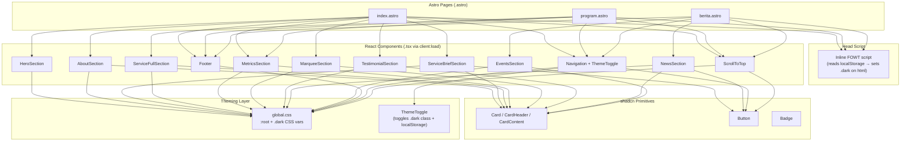

# Design Document: shadcn Dark Mode Migration

## Overview

This design covers the migration of the Exalter Students landing page from hardcoded-color Astro section components to shadcn UI-based React `.tsx` components, plus a full light/dark theme system. The site runs on Astro 6 + React 19 + Tailwind CSS v4.

The migration has two axes:

1. **Component migration** — Convert 9 `.astro` section components to `.tsx` React components that use shadcn primitives (Card, Button, Badge). Three existing `.tsx` components (Navigation, ScrollToTop, MarqueeSection) are updated in-place.
2. **Theming** — Replace all hardcoded hex colors and Tailwind color classes with shadcn CSS variable references, define brand-accurate light and dark palettes in `global.css`, and add a ThemeToggle with FOWT-prevention.

The visual layout and content remain identical; only the underlying component library and color system change.

## Architecture

### High-Level Flow



### Theme System Architecture

The theme system uses the standard shadcn class-based dark mode approach:

1. **CSS variables** in `global.css` define two scopes: `:root` (light) and `.dark` (dark).
2. **Tailwind utilities** like `bg-background`, `text-foreground`, `bg-card` resolve to these CSS variables automatically via the `@theme inline` block.
3. **ThemeToggle** component toggles the `dark` class on `<html>` and persists to `localStorage`.
4. **FOWT prevention** — A synchronous inline `<script>` in each page's `<head>` reads `localStorage` and applies `.dark` before first paint.

### Migration Strategy

Each `.astro` component converts to a `.tsx` file with the same name. The conversion follows this pattern:

1. Keep the same props interface (imported from `content-loader.ts`).
2. Replace Astro's `set:html` with `dangerouslySetInnerHTML` for inline SVG icons.
3. Replace hardcoded colors with CSS variable classes.
4. Wrap card-like `<div>` elements with shadcn `Card`, `CardHeader`, `CardContent`.
5. Replace `<a>` CTA buttons with shadcn `Button` using `asChild` + inner `<a>`.
6. Export as default React function component.

The three `.astro` pages remain as-is but update their imports to `.tsx` modules and add `client:load` to all section components.

## Components and Interfaces

### shadcn Components to Install

| Component | CLI Command | Used By |
|-----------|-------------|---------|
| Card | `npx shadcn@latest add card` | AboutSection, ServiceBriefSection, ServiceFullSection, MetricsSection, TestimonialSection, NewsSection, EventsSection, MarqueeSection |
| Button | (already installed) | ServiceBriefSection, NewsSection, Navigation, ScrollToTop |
| Badge | `npx shadcn@latest add badge` | EventsSection (date badge), MetricsSection (metric values) |

### New Component: ThemeToggle

```tsx
// src/components/ThemeToggle.tsx
interface ThemeToggleProps {
  className?: string;
}
```

- Renders a `<Button variant="ghost" size="icon">` containing a Sun or Moon icon from `lucide-react`.
- On click: toggles `document.documentElement.classList.toggle('dark')`, writes `localStorage.setItem('theme', newTheme)`.
- Reads initial state from the `<html>` element's class list (which the FOWT script already set).
- Includes `aria-label` that updates based on current theme.

### FOWT Prevention Inline Script

Placed in `<head>` of all three `.astro` pages:

```html
<script is:inline>
  (function() {
    var t = localStorage.getItem('theme');
    if (t === 'dark' || (!t && window.matchMedia('(prefers-color-scheme: dark)').matches)) {
      document.documentElement.classList.add('dark');
    }
  })();
</script>
```

### Component Migration Map

| Original (.astro) | New (.tsx) | shadcn Primitives | Props Source |
|---|---|---|---|
| HeroSection.astro | HeroSection.tsx | — (minimal, just CSS vars) | `{ title: string; subtitle: string }` |
| AboutSection.astro | AboutSection.tsx | Card, CardHeader, CardContent | `{ about: AboutContent }` |
| ServiceBriefSection.astro | ServiceBriefSection.tsx | Card, CardContent, Button | `{ title: string; cards: ServiceCard[] }` |
| ServiceFullSection.astro | ServiceFullSection.tsx | Card, CardContent | `{ title: string; subtitle: string; cards: ServiceCard[] }` |
| MetricsSection.astro | MetricsSection.tsx | Card, CardContent, Badge | `{ metrics: MetricsContent }` |
| TestimonialSection.astro | TestimonialSection.tsx | Card, CardContent | `{ testimonials: TestimonialCard[] }` |
| NewsSection.astro | NewsSection.tsx | Card, CardContent, Button | `{ news: NewsCard[] }` |
| EventsSection.astro | EventsSection.tsx | Card, CardContent | `{ events: EventCard[] }` |
| Footer.astro | Footer.tsx | — (CSS vars only) | (no props) |
| — | ThemeToggle.tsx | Button | `{ className?: string }` |

### Existing React Components (Updated In-Place)

| Component | Changes |
|---|---|
| Navigation.tsx | Replace hardcoded colors with CSS vars, add `ThemeToggle`, use shadcn `Button` for WhatsApp CTA and hamburger |
| ScrollToTop.tsx | Replace `style={{ background: '#1E3A8A' }}` with `bg-primary`, use shadcn `Button` |
| MarqueeSection.tsx | Replace hardcoded colors with CSS vars, wrap partner items in shadcn `Card` |

### Page Integration

Each `.astro` page:
1. Adds the FOWT inline script in `<head>`.
2. Imports `.tsx` components instead of `.astro`.
3. Adds `client:load` to all section components (Footer included, since it's now React).
4. Passes the same content data from `content-loader.ts`.


## Data Models

### CSS Variable Mappings

The brand colors map to shadcn CSS variables using oklch color space. The hex-to-oklch conversions:

| Brand Color | Hex | oklch (approximate) |
|---|---|---|
| Primary (Navy) | #1E3A8A | `oklch(0.327 0.115 264)` |
| Accent Blue | #3B82F6 | `oklch(0.623 0.214 259)` |
| CTA Amber | #F59E0B | `oklch(0.795 0.184 86)` |
| WhatsApp Green | #25D366 | `oklch(0.745 0.198 155)` |
| Text (Slate 900) | #0F172A | `oklch(0.178 0.028 265)` |
| Background (Slate 50) | #F8FAFC | `oklch(0.984 0.003 247)` |

### Light Mode (`:root`) Variable Definitions

```css
:root {
    --background: oklch(0.984 0.003 247);    /* #F8FAFC */
    --foreground: oklch(0.178 0.028 265);    /* #0F172A */
    --card: oklch(1 0 0);                     /* #FFFFFF */
    --card-foreground: oklch(0.178 0.028 265);/* #0F172A */
    --primary: oklch(0.327 0.115 264);        /* #1E3A8A */
    --primary-foreground: oklch(0.985 0 0);   /* white */
    --secondary: oklch(0.97 0.003 247);       /* slate-100 */
    --secondary-foreground: oklch(0.178 0.028 265);
    --muted: oklch(0.97 0.003 247);           /* slate-100 */
    --muted-foreground: oklch(0.556 0.016 265);/* slate-500 */
    --accent: oklch(0.623 0.214 259);         /* #3B82F6 */
    --accent-foreground: oklch(0.985 0 0);
    --border: oklch(0.922 0.008 265);         /* slate-200 */
    --input: oklch(0.922 0.008 265);
    --ring: oklch(0.623 0.214 259);           /* #3B82F6 */
    --cta: oklch(0.795 0.184 86);             /* #F59E0B */
    --cta-foreground: oklch(1 0 0);
    --whatsapp: oklch(0.745 0.198 155);       /* #25D366 */
    --whatsapp-foreground: oklch(1 0 0);
}
```

### Dark Mode (`.dark`) Variable Definitions

```css
.dark {
    --background: oklch(0.178 0.028 265);     /* #0F172A — slate-900 */
    --foreground: oklch(0.984 0.003 247);     /* #F8FAFC — slate-50 */
    --card: oklch(0.235 0.030 265);           /* ~slate-800 */
    --card-foreground: oklch(0.984 0.003 247);
    --primary: oklch(0.623 0.214 259);        /* #3B82F6 — lighter blue for dark bg */
    --primary-foreground: oklch(1 0 0);
    --secondary: oklch(0.279 0.030 265);      /* ~slate-750 */
    --secondary-foreground: oklch(0.984 0.003 247);
    --muted: oklch(0.279 0.030 265);
    --muted-foreground: oklch(0.708 0.010 265);/* slate-400 */
    --accent: oklch(0.623 0.214 259);         /* #3B82F6 */
    --accent-foreground: oklch(1 0 0);
    --border: oklch(0.350 0.030 265);         /* ~slate-700 */
    --input: oklch(0.350 0.030 265);
    --ring: oklch(0.623 0.214 259);
    --cta: oklch(0.795 0.184 86);             /* amber stays same */
    --cta-foreground: oklch(1 0 0);
    --whatsapp: oklch(0.745 0.198 155);       /* green stays same */
    --whatsapp-foreground: oklch(1 0 0);
}
```

### Tailwind Theme Registration

The `@theme inline` block must register the new custom colors:

```css
@theme inline {
    --color-cta: var(--cta);
    --color-cta-foreground: var(--cta-foreground);
    --color-whatsapp: var(--whatsapp);
    --color-whatsapp-foreground: var(--whatsapp-foreground);
    /* ... existing shadcn registrations ... */
}
```

This enables `bg-cta`, `text-cta`, `bg-whatsapp`, `text-whatsapp`, `bg-cta-foreground`, etc.

### Hardcoded Color Replacement Map

| Old Pattern | New Class |
|---|---|
| `bg-white`, `bg-[#F8FAFC]`, `style="background: #F8FAFC"` | `bg-background` |
| `bg-white` (inside cards) | `bg-card` |
| `text-[#0F172A]`, `text-slate-800`, `text-slate-900` | `text-foreground` or `text-card-foreground` |
| `text-slate-500`, `text-slate-600`, `text-slate-400` | `text-muted-foreground` |
| `text-[#1E3A8A]` | `text-primary` |
| `text-[#3B82F6]` | `text-accent` |
| `border-slate-200`, `border-blue-100` | `border-border` |
| `bg-[#F59E0B]`, `style="background: #F59E0B"` | `bg-cta` |
| `style="background: #25D366"` | `bg-whatsapp` |
| `style="background: #0F172A"` (Footer) | `bg-foreground dark:bg-background` or dedicated `--footer-bg` |
| `style="color: #1E3A8A"` | `text-primary` |

### Content Loader Types

The existing types in `content-loader.ts` remain unchanged. They flow into the new `.tsx` components as props:

```typescript
// Already defined — no changes needed
interface HeroContent { title: string; subtitle: string }
interface ValueCard { name: string; description: string }
interface AboutContent { title: string; subtitle: string; valueCards: ValueCard[]; summaryTitle: string; summaryDescription: string }
interface ServiceCard { name: string; description: string }
interface MetricItem { value: string; label: string }
interface AchievementCard { title: string; description: string }
interface MetricsContent { title: string; description: string; metrics: MetricItem[]; achievementCards: AchievementCard[] }
interface TestimonialCard { name: string; role: string; quote: string }
interface NewsCard { date: string; title: string; url: string }
interface EventCard { name: string; date: string; url: string }
```

Each `.tsx` component imports the relevant type from `@/lib/content-loader` and uses it as its props interface (or wraps it in a component-specific props type).

### Gradient Handling for Dark Mode

Two sections use gradient backgrounds that need dark-mode adaptation:

**HeroSection** — Currently `background: #0F172A` with overlay. In dark mode this stays dark; the overlay opacity adjusts slightly for contrast.

**MetricsSection** — Currently `background: linear-gradient(135deg, #1E3A8A 0%, #3B82F6 100%)`. In dark mode, shift to darker tones:
```css
/* Light: */
background: linear-gradient(135deg, oklch(0.327 0.115 264), oklch(0.623 0.214 259));
/* Dark: */
background: linear-gradient(135deg, oklch(0.220 0.090 264), oklch(0.420 0.170 259));
```

This is handled via Tailwind's `dark:` variant on the component's className or via a conditional class in the React component.


## Correctness Properties

*A property is a characteristic or behavior that should hold true across all valid executions of a system — essentially, a formal statement about what the system should do. Properties serve as the bridge between human-readable specifications and machine-verifiable correctness guarantees.*

### Property 1: Dark palette contrast ratios meet readability threshold

*For any* foreground/background CSS variable pair in the `.dark` scope (e.g. `--foreground` over `--background`, `--card-foreground` over `--card`, `--muted-foreground` over `--muted`, `--cta-foreground` over `--cta`), the WCAG 2.1 contrast ratio between the two oklch colors SHALL be at least 4.5:1 for normal text.

**Validates: Requirements 1.6**

### Property 2: ThemeToggle round-trip

*For any* initial theme state (light or dark), clicking the ThemeToggle should: (a) flip the `dark` class on `document.documentElement`, (b) persist the new theme to `localStorage` under the key `'theme'`, (c) display the correct icon (Sun in dark mode, Moon in light mode), and (d) update the `aria-label` to describe switching to the opposite mode.

**Validates: Requirements 2.1, 2.2, 2.3, 2.4**

### Property 3: FOWT script applies correct theme from localStorage

*For any* value stored in `localStorage` under the key `'theme'` (including `'dark'`, `'light'`, or absent), the FOWT inline script should set the `dark` class on `<html>` if and only if the stored value is `'dark'` OR (no stored value AND `prefers-color-scheme: dark` matches). When no stored value exists and no OS preference is detected, the `dark` class should be absent (light mode default).

**Validates: Requirements 3.1, 3.2, 3.3**

### Property 4: Section components render shadcn primitives

*For any* section component that is specified to use shadcn Card (AboutSection, ServiceBriefSection, ServiceFullSection, MetricsSection, TestimonialSection, NewsSection, EventsSection), when rendered with any valid content data, the output HTML SHALL contain elements with `data-slot="card"` attributes corresponding to each content item.

**Validates: Requirements 5.1, 5.2, 5.3, 5.4, 5.5, 5.6, 5.7**

### Property 5: No hardcoded color values in rendered component output

*For any* section component (HeroSection, AboutSection, ServiceBriefSection, ServiceFullSection, MetricsSection, TestimonialSection, NewsSection, EventsSection, Footer, Navigation) rendered with any valid content data, the output HTML SHALL contain zero inline `style` attributes that set `color`, `background-color`, `background`, or `border-color` to hex values, AND zero Tailwind classes matching the banned patterns (`bg-white`, `bg-[#...]`, `text-[#...]`, `text-slate-*`, `border-slate-*`).

**Validates: Requirements 6.1, 6.2, 6.3, 6.4, 6.5, 6.6, 6.7, 6.8, 6.9**

### Property 6: Dark mode applies dark backgrounds and light text

*For any* section component rendered while the `dark` class is present on the root element, the component's container SHALL use CSS variable-based background classes (e.g. `bg-background`, `bg-card`) that resolve to dark values, and text classes (e.g. `text-foreground`, `text-card-foreground`) that resolve to light values.

**Validates: Requirements 8.1, 8.2**

## Error Handling

### Theme Toggle Errors

- **localStorage unavailable** (e.g. private browsing, storage quota): The ThemeToggle should catch exceptions from `localStorage.setItem()` and still toggle the `dark` class on `<html>`. The theme works for the current session but won't persist.
- **FOWT script localStorage read failure**: The inline script wraps the `localStorage.getItem()` call in a try/catch. On failure, it falls back to `prefers-color-scheme` media query, then defaults to light mode.

### Component Rendering Errors

- **Missing content data**: Each `.tsx` component should handle empty arrays gracefully (render nothing for the list, still render the section header). The content-loader already returns empty arrays for missing sections.
- **Missing image paths**: Image elements use the existing static paths. If an image fails to load, the browser's default broken-image behavior applies. No special error boundary needed.

### Build-Time Errors

- **Missing shadcn components**: If Card or Badge aren't installed, TypeScript compilation fails with clear import errors. The task list includes installation steps before component migration.
- **Type mismatches**: The `.tsx` components import the same types from `content-loader.ts`. TypeScript catches any prop mismatches at build time.

## Testing Strategy

### Dual Testing Approach

This migration uses both unit tests and property-based tests:

- **Unit tests** — Verify specific examples: correct rendering of a known content fixture, FOWT script behavior with specific localStorage values, ThemeToggle click producing expected DOM changes.
- **Property-based tests** — Verify universal properties across randomly generated content data: no hardcoded colors in output, shadcn primitives present, contrast ratios valid.

### Property-Based Testing Configuration

- **Library**: `fast-check` (already in devDependencies)
- **Test runner**: `vitest` with `jsdom` environment (already configured)
- **Minimum iterations**: 100 per property test
- **Tag format**: Each property test includes a comment: `// Feature: shadcn-dark-mode-migration, Property {N}: {title}`

### Test Plan

| Property | Test Type | What It Generates | What It Asserts |
|---|---|---|---|
| Property 1: Contrast ratios | Property (fast-check) | Random pairs from the defined foreground/background variable set | WCAG contrast ratio ≥ 4.5:1 |
| Property 2: ThemeToggle round-trip | Property (fast-check) | Random initial theme state (light/dark) | Class toggle, localStorage update, icon switch, aria-label update |
| Property 3: FOWT script | Property (fast-check) | Random localStorage values ('dark', 'light', null) × random OS preference (dark, light, none) | Correct `dark` class presence/absence |
| Property 4: shadcn primitives | Property (fast-check) | Random valid content arrays for each section component | `data-slot="card"` elements present in rendered HTML |
| Property 5: No hardcoded colors | Property (fast-check) | Random valid content strings for each section component | Zero matches for banned color patterns in rendered HTML |
| Property 6: Dark mode classes | Property (fast-check) | Random section component rendered with `.dark` on root | CSS variable-based classes present, no light-only classes |

### Unit Test Examples

- Render ThemeToggle, click it, verify `document.documentElement.classList.contains('dark')`.
- Render AboutSection with a known fixture, verify Card count matches `valueCards.length + 1` (summary card).
- Render Footer, verify no inline `style` attributes with color values.
- FOWT script with `localStorage.theme = 'dark'` → `<html>` has `dark` class.
- FOWT script with no localStorage, `prefers-color-scheme: dark` → `<html>` has `dark` class.
- FOWT script with no localStorage, no OS preference → `<html>` has no `dark` class.

### What Each Property Test Must Include

Each property-based test MUST:
1. Be implemented as a SINGLE `fc.assert(fc.property(...))` call
2. Run at least 100 iterations (`{ numRuns: 100 }`)
3. Include a comment tag: `// Feature: shadcn-dark-mode-migration, Property {N}: {title}`
4. Reference the design document property it validates
